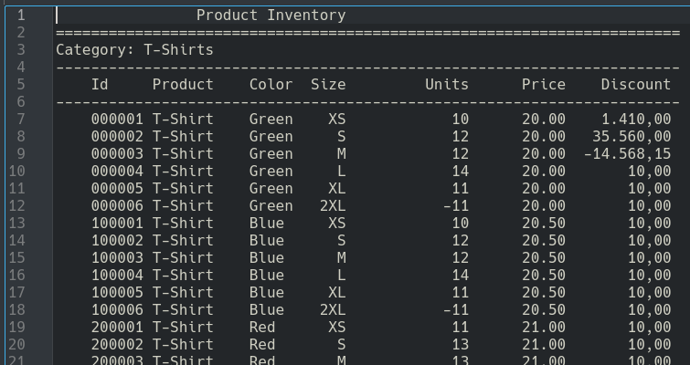
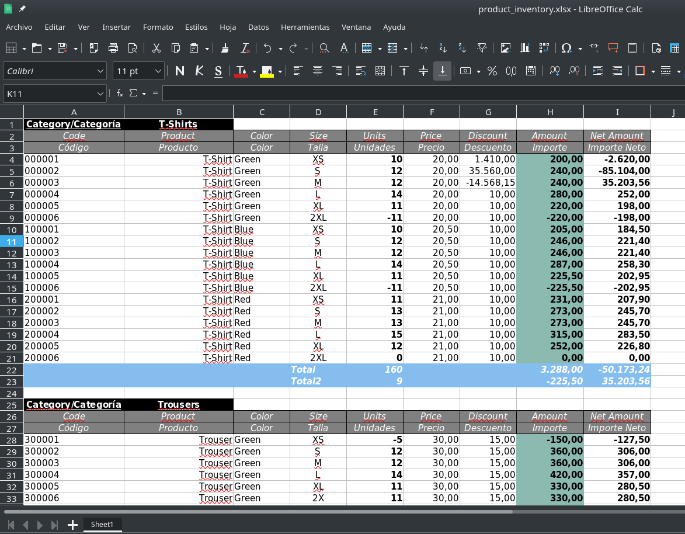

# Redaxtor (REport DAta eXtracTOR)

**Redaxtor** es una aplicación para la **extracción de datos** desde ficheros de texto tabulados y su **conversión a Excel**. A los datos extraídos se les puede **asignar un tipo** (texto o varios tipos numéricos) y **aplicarles formatos** de presentación (negrita, color, fuente,..). Además, se pueden **añadir nuevos campos**, ya sean valores fijos o calculados mediante el **uso de fórmulas** y **enlazar con otros libros** de Excel. También admite la **exportación a los formatos JSON, CSV, XML y HTML**.

Redaxtor es una aplicación escrita en python usando las librerías [pyparsing](https://github.com/pyparsing/pyparsing/), [xlsxwriter](https://github.com/jmcnamara/XlsxWriter) y [jinja](https://github.com/pallets/jinja/).

Redaxtor define un sencillo **DSL** ([Domain Specific Language](https://en.wikipedia.org/wiki/Domain-specific_language)) para definir qué datos serán extraídos del fichero de entrada, cómo se procesarán y agruparán, qué datos adicionales se añadirán y cómo se formatearán para crear un libro de Excel.

Redaxtor está pensado para convertir a Excel (u otro de los formatos soportados) muchos archivos de texto de distintos formatos de manera rápida y sin intervención con solo un pequeño trabajo inicial.

Para cada tipo de fichero que queramos procesar se debe crear un fichero de configuración usando el DSL. Es una tarea que solo se hace una vez para cada tipo de fichero y, a partir de ese momento, podremos convertir los ficheros de ese tipo a Excel automáticamente.

## Uso
---

### Script redaxtor.py:

Este es el sctipt principal de la aplicación.

~~~
redaxtor.py [-h] -c CONF_FILE [-o OUTPUT_FOLDER] [-tf TEMPLATES_FOLDER] [-t] [-k] [-f {xlsx,csv,html,xml,json}] files [files ...]
~~~

- Argumentos posicionales:
  - **files**:  Fichero/s de entrada que será/n procesados. Genera un fichero de salida por cada fichero de entrada. 

- Argumentos opcionales:
  - **-h**, --**help**: muestra la ayuda del programa.
  
  - **-c CONF_FILE**, **--conf-file CONF_FILE**: **CONF_FILE** es un fichero de configuración que se usará para transformar el listado.
  
  - **-o OUTPUT_FOLDER**, **--output-folder OUTPUT_FOLDER**: **OUTPUT_FOLDER** es la carpeta donde se guardaran los ficheros generados. Por defecto es la carpeta donde reside el script.
  
  - **-tf TEMPLATES_FOLDER**, **--templates-folder TEMPLATES_FOLDER**: **TEMPLATES_FOLDER** es la carpeta donde se encuentran los archivos **csv.jinja**, **json.jinja**, **xml.jinja** y **html.jinja**. Son  las plantillas de Jinja necesarias para generar la salida en los formatos correspondientes. Por defecto es la subcarpeta **templates** bajo la carpeta donde reside el script.
  
  - **-t**, **--time-stamp**: usa una marca de tiempo como prefijo de los nommbres de los ficheros generados.
  
  - **-k**, **--keep-extension**: mantiene las extensiones de los ficheros de entradas en los nombres de los ficheros de salida generados.

  - **-f {xlsx,csv,html,xml,json}**, **--format {xlsx,csv,html,xml,json}**: formato de salida. Por defecto: **xlsx**.

### Script config_parser.py:

Este script es el encargado de parsear los ficheros del DSL. Puede usarse para comprobar que un fichero es correcto.

~~~
config_parser.py [-h] file
~~~

- Argumentos posicionales:
  - **file**: procesa un fichero de definición de un reporte.

- Argumentos opcionales:
  - **-h**, --**help**: muestra la ayuda del programa.

### Script excel_parser.py:

Este script es el encargado de parsear las fórmulas de Excel. Puede usarse para comprobar que un fichero es correcto (ver fichero [expressions.txt](examples/expressions.txt))

~~~
excel_parser.py [-h] file
~~~

- Argumentos posicionales:
  - **file** : procesa un fichero con expresiones y formulas de excel.

- Argumentos opcionales:
  - **-h**, --**help**: muestra la ayuda del programa.

### Script styles_parser.py:

Este script es el encargado de parsear los estilos. Puede usarse para comprobar que un fichero es correcto (ver fichero [styles.conf](examples/styles.conf)).

~~~
styles_parser.py [-h] file
~~~

- Argumentos posicionales:
  - **file**: procesa un fichero de estilos.

- Argumentos opcionales:
  - **-h**, --**help**: muestra la ayuda del programa.

## Introducción
---

Tomemos como punto de partida el fichero _[product_inventory.txt](examples/product_inventory/product_inventory.txt)_ (los ficheros mencionados aquí están en la carpeta _[examples/product_inventory](examples/product_inventory/)_):

El primer paso sería crear un fichero de configuración que defina cómo queremos procesar el fichero. Le llamaremos _[product_inventory.conf](examples/product_inventory/product_inventory.conf)_ (tanto el nombre como la extensión son indiferentes).

Lo primero que debemos hacer es asignarle un título al fichero:

~~~
title Product Inventory
~~~

**title** es una palabra clave del DSL y **Product Inventory** es el título asignado. Debe ocupar una única línea y no es necesario el uso de comillas para delimitar el texto.

Opcionalmente, se puede añadir una descripción más completa sobre el cometido de este fichero: que archivos va a procesar, que datos se extraerán...

~~~
# texto explicando el propósito de este fichero
description
Listado de existencias de prodcutos
/description
~~~

La descripición es todo el texto comprendido entre las palabras claves **description** y **/description**. Como se aprecia en el código, es posible crear comentarios de línea con el carácter **#** al igual que en **Python**.

Por defecto los ficheros de entrada usan la codificación UTF-8. La palabra clave **encoding** permite indicar otra codificación. Las codificaciones válidas son: **utf-8**, **ascii**, **utf-16** y **latin-1**. Para usar la codificación **ascii** añadiríamos la línea:

~~~
encoding ascii
~~~

El fichero que vamos a generar será un libro de Excel con una única hoja. Para establecer el ancho de las columnas debemos usar la directiva **columns_width**:

~~~
# ancho de las tres primeras columnas de la hoja
# el resto de columnas tendrá el ancho por defecto
columns_width 17 20 10 
~~~

Redaxtor agrupa los datos en secciones (**section**), que son conjuntos de datos relacionados. Cada sección se divide en tres partes: cabecera (**header**), cuerpo (**body**) y pie (**footer**). Solo **body** es obligatoria. A su vez, cada una de estas partes está formada por uno o más conjuntos de campos (**fieldset**). Cada **fieldset** declara uno o más campos, que son los datos que formarán parte de la salida. Los campos pueden ser de dos tipos: **campos extraídos**, que se obtienen del fichero de entrada, y **campos especiales**, que no existen en el fichero de entrada y serán añadidos a la salida. Los **fieldset** definidos en **header** y en **footer** solo pueden declarar campos especiales, mientras que los **fieldset** definidos en **body** pueden declarar campos de los dos tipos.

La cabecera (**header**) se mostrará al principio de la sección. Su finalidad principal es la de encabezado de las columnas.

El pie (**footer**) se mostrará al final de la sección. Su finalidad principal es calcular los totales u otros resúmenes de los datos (media, mediana,...). Tanto **body** como **header** solo serán visibles si la sección contiene datos.

El cuerpo (**body**) es obligatorio y es donde se definen los datos a extraer y el tipo (texto o algún tipo numérico) a asignar a cada dato. 

Un **fieldset** representa un conjunto de datos que se corresponden  con una línea de texto del fichero de entrada y/o con una fila del libro de Excel a generar.

Cada **fieldset** define que líneas del fichero de entrada que quiere procesar. Para ello usa la directiva **include_filters** que es una lista de expresiones regulares de **python** entrecomilladas y separadas por comas. Por ejemplo:

~~~
section
    body                                   # el cuerpo de la sección, obligatorio
        fieldset                           # el cuerpo debe tener al menos un 
            include_filters "^[ ]*\d{6} "  # expresiones regulares separadas por comas
~~~

La línea anterior hace que el **fieldset** procese las líneas que concuerden con la expresión regular **"^[ ]*\d{6} "**, en este caso las líneas que empiezan por cero o más espacios seguidos de seis dígitos y un espacio. El fieldset ignorara el resto de líneas.

Los **campos extraídos** se obtienen del fichero de entrada, que es un fichero tabulado, lo que significa que los datos ocupan una posición específica dentro de la línea de texto que se está procesando. Para extraer un dato debemos dar su posición izquierda y derecha dentro de la línea (los índices comienzan en 0). Además debemos asignar un tipo de datos al campo. Veamos un ejemplo:

~~~
section
    body  # the body of the section, mandatory
        fieldset
            include_filters "^[ ]*\d{6} "
            string 4 10
            integer 11 21
            real 22 29
            decimal 30 33
            fixed 38 47
~~~

La línea **string 4 10** extrae el texto entre las posiciones 4 y 10 de la línea de entrada y lo convierte a una cadena de texto (**string** de **python**) y será la primera columna de esa fila en el libro de Excel. Las siguientes tres líneas convierten el texto extraído a un entero, real y decimal (el tipo adecuado si estamos tratando con monedas), respectivamente (tipos **int**, **float** y **decimal** de **python**), siendo la segunda, tercera y cuarta columnas del libro de Excel. La última línea también convierte el texto extraído a una cadena de texto. La diferencia entre **string** y **fixed** es que el primero elimina los espacios en blanco al inicio y final del texto, mientras que **fixed** deja el extraído inalterado. Los tipos **int**, **float** y **decimal** permiten algunas variaciones para lidiar con los separadores decimal y de millares. Si la línea de entrada fuese:

~~~
    000001         11   20.50 225.50  Fixed string   
~~~

Obtendríamos los siguientes datos:

    - String('000001')
    - Integer(11)
    - Real(20.5)
    - Decimal(225.5)
    - String('Fixed string   ')

En cuanto a los **campos especiales** existen tres tipos: **empty**, **const** y **function**. Son campos que no existen en el fichero de entrada y serán añadidos a la salida. **empty** representa una celda vacía y puede ir seguido de un entero positivo para indicar un número de celdas vacías contiguas (en la misma fila). **const** representa un valor constante que se añadirá tal cual a la salida y puede ser un número o texto. **function** es el más interesante ya que permite añadir un campo calculado, esto es, el campo es una fórmula de Excel que será evaluada al abrir el libro en Excel. Veamos un ejemplo:

~~~
section
    body  
        fieldset
            empty         # añade una celda vacía
            const 5       # añade una celda con el número 5
            const "Total" # añade una columna con el texto Total
            # añade una celda con una formula para caluclar una suma
            function =sum(D1:D5) 
            empty 2 # añade dos celdas vacías contiguas en la misma fila
            # añade una celda con una formula para caluclar la mediana
            function =median(<col><startrow>:<col><rows>)
~~~

Los campos de **empty** y **const** se explican por sí solos. **function** representa una fórmula de Excel. Los nombres de la funciones deben ser los nombres de la versión inglesa de Excel (por eso uso **SUM** y **MEDIAN** en lugar de **SUMA** y **MEDIANA**). La web [Excel-Translator](https://en.excel-translator.de/translator/) permite traducir los nombres de las fórmulas. El primer campo **function** usa un rango de excel (**D1:D5**), que es fijo y no varía. El segundo camp **function**, que calcula la mediana, usa un **rango dinámico** que se ajusta a la estructura de la hoja. Para ello hace uso de **marcadores de posición** que serán sustituidos por los valores adecuados en el momento de generar el libro de Excel. Los posibles valores de posición son:

- **\<row\>**: es la fila actual. Puede llevar un entero para referenciar filas anteriores o posteriores. Por ejemplo: **\<row:-1\>** es la fila que está encima de la actual y **\<row:1\>** es la fila justo debajo. **\<row\>** es equivalente a **\<row:0\>**. Por ejemplo, si estamos en la cuarta fila de una hoja de Excel, **\<row\>** se sutituye por la fila 4, **\<row:-1\>** por 3 y **\<row:1\>** por 5.

- **\<col\>**: es la columna actual. Puede llevar un entero para referenciar columnas anteriores o posteriores. Por ejemplo: **\<col:-1\>** es la columna a la izquierda y **\<col:1\>** es la columna a la derecha. **\<col\>** es equivalente a **\<col:0\>**. Por ejemplo, si estamos en la cuarta columna de una hoja de Excel, **\<col\>** se sutituye por la columna D, **\<col:-1\>** por C y **\<col:1\>** por E. Siguiendo con el ejemplo, **\<col\>\<row\>** se sutituiría por la celda D4, **\<col:-1\>\<row:-1\>** por C3 y **\<col:1\>\<row:1\>** por E5.

- **\<startrow\>**: es la fila inicial de la seccion actual sin incluir las filas de cabeceras.

- **\<rows\>**: es el número total de filas en el listado, incluyendo encabezados y pies.

Para las fórmulas de Excel se debe usar la coma (,) como separador de parámetros en lugar del punto y coma (;). Es importante resaltar que el parser solo comprueba la corrección sintática de las fórmulas y no su validez (eso queda en manos de Excel). Eso significa que el parser no se quejará si usamos nombres de funciones inexistentes.

El **body** de una **section** puede tener más de un **fieldset**, cada uno procesando un tipo de líneas y extrayendo distintos datos. O incluso distintos **fieldset** podrían procesar las mismas líneas de distinta manera.

El **header** y el **footer** de una **section** también está formado por uno o más **fieldset** pero en este caso solo se pueden usar campos especiales y no campos extraídos, es decir, solo se pueden usar **empty**, **const** y **function**. La idea es que sirvan como encabezado y pie de las secciones y no como contenedores de datos.

Veamos un ejemplo más complejo:

~~~
style code_style       # declaramos el estilo con nombre code_style que usaremos más tarde
    color white        # color predefinido en Excel
    background 85BDEF  # color en notacion RRGGBB sin el # inicial
    bold               # texto en negrita
    italic             # texto en cursiva

section

    blank_row  # añade una fila en blanco después de la sección

    header  # 
        fieldset
            const "Code" 
            const "Product" 
            const "Color"
            const "Size"
            const "Units"
            const "Price"
        fieldset
            const "Código" 
            const "Producto"
            const "Color"
            const "Talla"
            const "Unidades"
            const "Precio"

    body  
        fieldset
            include_filters "^[ ]*\d{6} "
            string 4 10 as code : code_style
            string 11 21 as product 
            string 22 29 as color
            string 30 33 as size 
            integer 38 47 as units 
            decimal 48 58 as price 

    footer  
        fieldset
            empty 3 
            const "Total" : footer_field
            function =sum(<col><startrow>:<col><rows>) 
~~~

Aquí usamos un **header** con dos **fieldset** para crear dos filas consecutivas con los encabezados de los campos, una en inglés y otra en español. Por su parte, **footer** usa una suma para calcular el total de unidades. **\<startrow\>** señala a la primera fila de datos justo debajo de los encabezados y **\<rows\>** a la fila anterior al pie (se podría cambiar por **\<row:-1\>**). 

Con la expresión **string 4 10 as code : code_style** estamos asignando el nombre **code** al campo extraído. Asignar nombres a los campos es opcional pero es útil cuando queremos exportar los datos a otros formatos en vez de a Excel, ya que se usarán esos nombres para los campos. También le estamos asignando el estilo **code_style** al campo. El estilo debe haber sido declarado previamente con la directiva **Style**. El estilo nos permite controlar la apariencia de un campo en el libro de Excel: tipo de fuente, tamaño, color, bordes,...

En el código anterior aparece por primera vez la directiva **blank_row**, que añade una fila en blanco en la hoja de Excel despúes de la sección.

Para terminar esta introducción, comparemos el fichero original (_[product_inventory.txt](examples/product_inventory/product_inventory.txt)_) conel libro de Excel resultante (_[product_inventory.xlsx](examples/product_inventory/product_inventory.xlsx)_) al procesarlo usando el archivo de configuración _[product_inventory.conf](examples/product_inventory/product_inventory.conf)_:

Este es el fichero de entrada:

Y esta sería la hoja de cálculo generada:

Se puede observar que en el libro de Excel los datos tienen formatos aplicados: colores de fondo, negrita,...Son características que no hemos mencionado en esta introducción. También se ve en la imagen que el libro está abierto con LibreOffice. En general, se puede usar LibreOffice aunque puede darse el caso de que alguna fórmula de Excel no se interprete bien (en concreto, con el parser actual la referencia a datos en libros externos no funciona en LibreOffice).

En la carpeta de [examples](examples/) hay más ejemplos comentados.

## Tipos de campos
---

Los campos se declaran dentro de un **fieldset** y definen los datos que obtendremos a la salida. Los campos pueden ser **especiales** o **extraídos**. Los campos especiales pueden estar en el **header**, **body** y **footer**. Son datos que no existen en el fichero de entrada pero serán incorporados a la salida. Los campos extraídos solo pueden estar en el **body** y como su nombre suigiere se extraen del fichero de entrada y formarán parte de la salida.

- **Campos especiales**:

    - **function**: campo calculado, cadena que representa una fórmula de Excel.
    - **empty**: campo vacío, añade una celda vacía. Puede llevar un entero para indicar más de una celda.
    - **const**:  campo valor, constante que puede ser una cadena o un número.

- **Campos extraídos**:

    - **Campos de texto**
        - **string**: campo de cadena de ancho variable, se eliminan los espacios del final.
        - **fixed**: campo de cadena de ancho fijo, se mantienen los espacios del inicio y del final.

    - **Campos numéricos**. Indican el **formato numérico necesario para interpretar los datos de entrada**, no se aplica a los datos de salida.

        - **Números enteros**. Se mapean a un **int** de python:
            - **integer**: sin separador de millar (1234).
            - **integerc**: usa , como separador de millar (1,234).
            - **integerd**: usa . como separador de millar (1.234).

        - **Números en coma flotante**. Se mapean a un **float** de python:
            - **float**: sin separador de millar y usa . como separador decimal (1234.56).
            - **floatc**: sin separador de millar y usa , como separador decimal (1234,56).
            - **floatcd**: usa , como separador de millar y usa . como separador decimal (1,234.56).
            - **floatdc**: usa . como separador de millar y usa , como separador decimal (1.234,56).

        - **Números decimales**. Se mapean a un **Decimal** de python (módulo decimal):
            - **decimal**: sin separador de millar y usa . como separador decimal (1234.56).
            - **decimalc**: sin separador de millar y usa , como separador decimal (1234,56).
            - **decimalcd**: usa , como separador de millar y usa . como separador decimal (1,234.56).
            - **decimaldc**: usa . como separador de millar y usa , como separador decimal (1.234,56).

## Formatos de Excel
---

Podemos usar la palabra clave **style** para declarar el formato de celda que se aplicará a un campo. Estos formatos solo son efectivos en Excel. Las opciones disponibles son:

- **format**: formato numérico o de texto a aplicar a la celda
- **font**: nombre de la fuente a utilizar.
- **size**: tamaño de fuente.
- **bold**: texto en negrita.
- **italic**: texto en cursiva.
- **underline**: texto subrayado
- **strikeout**: texto tachado.
- **align**: alineación horizontal. Posibles valores: **left**, **center**, **right** y **justify**.
- **valign**: alineación vertical. Posibles valores: **top**, **bottom**, **center**, **justify**.
- **border**: color y estilo del borde. El color es opcional.
- **background**: color de fondo.
- **color**: color del texto.
- **unlocked**: la celda estará desprotegida. En Excel las celdas están protegidas por defecto.
- **hidden**: la celda estará oculta. En Excel las celdas son visibles por defecto.
- **wrap**: ajusta el texto a la celda.
- **shrink**: reduce el texto hasta ajustarlo en la celda.

Los colores pueden escribirse en formato hexadecimal RRGGBB , como en **CSS** pero sin el signo **#** (ejemplo AABB11), o usando uno de los siguientes nombres predefinidos: **black**, **blue**, **brown**, **cyan**, **gray**, **green**, **lime**, **magent**, **navy**, **orange**, **pink**, **purple**, **red**, **silver**, **white**, **yellow**.

Los estilos de borde aplicables están predefinidos y son los siguientes: **no_line**, **thin**, **medium**, **dashed**, **dotted**, **thick**, **double**, **hair**, **medium_dashed**, **thin_dash_dotted**, **medium_dash_dotted**, **thin_dash_dot_dotted**, **medium_dash_dot_dotted**, **slanted_medium_dash_dotted**.

En el fichero [styles.conf](examples/styles.conf) hay varios ejemplos de estilos. Más información sobre formatos de celda en la página https://xlsxwriter.readthedocs.io/format.html.

## Flags
---

El DSL define varios flags que modifican la presentación de las secciones (**section**) y fieldsets (**fieldset**).

### Section flags:

Hay dos flags que pueden usarse dentro de las secciones. Deben declararse antes de **header**, **body** y **footer** y pueden usarse conjuntamente (**process_only_one_time** iría primero):

- **process_only_one_time**: la sección solo se procesara la primera vez que aparezca y se ignorará las siguentes. Esto es útil, por ejemplo, cuando en el texto una línea con encabezados que solo queremos que aparezca una vez.

Ejemplo:
~~~
section
    process_only_one_time
    body
        fieldset
            include_filters "^\d{5} "
            integer 0 5 as code : code
~~~

- **blank_row**: añade una fila en blanco después de la sección (en la hoja de Excel).

Ejemplo:
~~~
section
    blank_row
    header
        fieldset
            const "Code" : header_field
            const "Customer" : header_field
~~~

### Fieldset flags:

Hay dos flags que pueden usarse dentro de un **fieldset** y solo dentro del **body**. Deben declararse después de **include_filters** y antes de la delaración de los campos:

- **keep_in_row**: hace que no se añada una nueva fila a la salida despúes de procesar la línea en curso. Los campos de las siguientes líneas se situarán en la misma fila que los de la línea en curso.

Ejemplo:

~~~
section
    body
        fieldset
            include_filters "^\d{5} "
            keep_in_row
            integer 0 5 as code : code
~~~

- **new_row**: fuerza a que los campos de la línea en curso se añadan en una nueva línea aunque se haya usado el flag **keep_in_row**.

Ejemplo:

~~~
section
    body
        fieldset
            include_filters "^\d{5} "
            new_row
            integer 0 5 as code : code
~~~

## Exclude Filters
---

Los **exclude_filters** son una lista opcional de expresiones regulares separadas por comas. Las líneas que concuerden con alguna de las expresiones regulares son descartadas inmediatemente. Se debe declarar antes cualquier estilo.

Ejemplo:

~~~
title Product Inventory

description
This is a test report
/description

encoding utf-8

columns_width 17 20 10 10 10 10 10 12 12

exclude_filters "^==*","^--*"

style category_field  # name of the style
    color white  # color of the text font by name
    background black  # background color by name
    align center  # horizontal align of the cell
    bold  # bold text
    underline  # underline text
~~~
